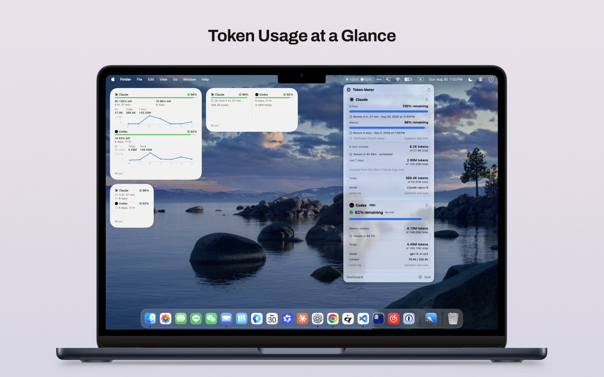
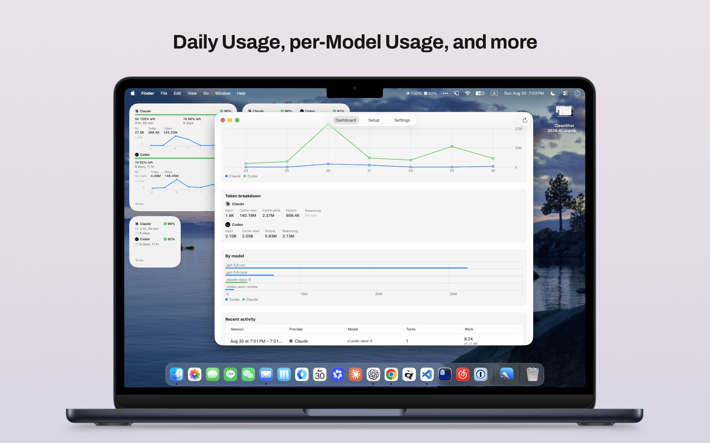
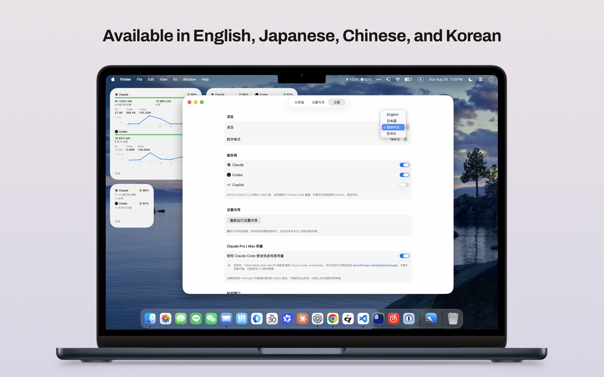

# Token Meter

[English](README.md) · [日本語](README.ja.md) · **简体中文** · [한국어](README.ko.md)

用于查看 Claude Code、Codex、Copilot CLI 用量的 macOS 原生应用。

> [!IMPORTANT]
> **Windows 版开发已冻结。** Windows 源码仅作为参考保留在本仓库中；不会再发布、更新、维护或提供支持，也不会提交 Microsoft Store 或进行直接分发。请勿将 Windows 代码或历史文档视为受支持的产品。Token Meter 当前仅支持 macOS。

[](https://github.com/TakeruF/token_meter/releases/latest)

[官方网站 · 下载](https://takeruf.github.io/token_meter/) · [GitHub Releases](https://github.com/TakeruF/token_meter/releases/latest)

## 截图

**菜单栏与小组件，用量一目了然。**



**仪表盘按日期与模型细分用量。**



**支持英语、日语、简体中文和韩语。**



macOS 版使用 Swift / SwiftUI / WidgetKit，既不使用 WebView 也不使用 Electron。Token 历史在本地汇总。
只有在你明确启用后，应用才会为查询 Claude Pro / Max 用量而访问 Anthropic 的 OAuth 用量端点。

---

## ⚠️ 请先阅读：这个应用能取得什么、不能取得什么

针对真实日志的调查结果（详见 [docs/data-sources.md](docs/data-sources.md)）：

| | Claude Code | Codex | Copilot CLI |
|---|---|---|---|
| Token 用量（输入 / 缓存 / 输出） | ✅ | ✅ | ✅ 会话结束时 |
| 推理 Token | ❌ 未单独区分 | ✅ | ❌ 不上报 |
| 使用的模型 | ✅ | ✅ | ✅ |
| 历史与每日汇总 | ✅ | ✅ | ✅ |
| **5 小时限额内的 Token 数** | ⚠️ 实测（限额区间为推算） | ✅ 仅当 Codex 上报 5 小时限额时 | ❌ 没有限额的概念 |
| **每周限额内的 Token 数** | ⚠️ 实测（最近 7 天滚动） | ✅ 真实的每周限额 | ❌ |
| **使用率（%）** | ✅ 启用 OAuth 集成时 | ✅ | ❌ 本地没有 |
| **剩余可用量** | ✅ 启用 OAuth 集成时 | ✅ | ❌ |
| **限额重置时间** | ✅ 启用 OAuth 集成时（本地值为推算） | ✅ 上报值 | ❌ |
| 上下文窗口大小 | ❌ 无法取得 | ✅ | ❌ |

**Claude Code 不会把使用率、剩余量、重置时间写入本地日志。**
`claude` CLI 中不存在 `usage` 子命令（已核对 `--help` 中的全部命令），
`/usage` 只是交互式会话内的斜杠命令。配置文件中同样没有对应的数值。

在设置中启用 Claude OAuth 用量检查后，应用会通过 Security 框架从 macOS 钥匙串读取
`Claude Code-credentials`，并调用 `GET https://api.anthropic.com/api/oauth/usage`
获取 5 小时、7 天以及可选的 Sonnet 7 天限额。集成关闭或获取失败时，不会显示推算的百分比。

### 为什么无法做到「选择方案后显示百分比」

Anthropic **没有公开各方案的 Token 上限**。
官方说明限制会随对话长度、复杂度、所用模型和 effort 变动，因此没有固定数值。
此外，(1) Opus 的计费倍率是 Sonnet 的数倍（倍率未公开），
(2) 限额与 claude.ai（网页 / 桌面 / 移动端）共用，其他机器上的使用也会消耗同一份额度。

分母并不存在，分子（这台 Mac 的 Claude Code 日志）也不完整，
所以应用不会根据本地数值计算百分比。显示的百分比只有 Anthropic 用量响应中包含的那些。

### 作为替代显示的内容（全部为实测值）

| | 内容 | 重置时间 |
|---|---|---|
| Claude Code · 5 小时限额 | 当前会话区块内的 Token 数 | ⚠️ **推算**（见下） |
| Claude Code · 最近 7 天 | 7 天滚动合计 | 无（每周起点未知） |
| Codex · 5 小时 / 每周限额 | 该限额内消耗的 Token 数 | ✅ Codex 的上报值 |
| Copilot CLI · 今日 / 历史 | 会话结束时确定的各模型 Token 数 | 无（未公开限额） |

Anthropic 说明「5 小时会话限额从第一条消息开始，持续 5 小时」。
这里 Claude Code 的 5 小时重置时间，是**把该规则套用到本地日志上复现出来的结果**，
并非 Anthropic 输出的数值。界面上始终标注 *estimated*，
并附带「仅汇总这台 Mac 的 Claude 日志」的说明。

Codex 会把 `rate_limits`（`used_percent` / `resets_at` / `window_minutes`）写入日志，
因此使用率、剩余量和重置时间都能作为真实数据显示。
限额起始时间也可由 `resets_at - window_minutes` 确定，所以限额内的 Token 数同样是实测值。

Copilot CLI 不会把限额写到本地，因此使用率、剩余量、重置时间都不显示。
Token 数来自 `session.shutdown` 事件中各模型的累计值，
所以**在结束一次会话后才会反映**（运行中的会话尚未计入）。

以上各项都可以在 **设置 > Time windows** 中单独关闭。

---

## 运行环境

| | |
|---|---|
| macOS | 14.0 以上（开发与验证环境为 macOS 26.5） |
| Xcode | 15 以上（验证环境为 Xcode 26.2） |
| Swift | 5.9 以上（验证环境为 6.2.3） |
| 项目生成工具 | [XcodeGen](https://github.com/yonaskolb/XcodeGen)（`brew install xcodegen`） |

`Windows/` 中保留着冻结的实现，仅供参考；不会提供支持或分发。
其中的历史构建、签名和安装资料不应被视为发布说明。

## 构建

```bash
# 1. 生成 Xcode 项目（来自 project.yml）
xcodegen generate

# 2. 构建
open TokenMeter.xcodeproj    # 在 Xcode 中按 ⌘R

# 或使用命令行
xcodebuild -project TokenMeter.xcodeproj -scheme TokenMeter \
  -configuration Debug -destination 'platform=macOS' build
```

### 关于签名（要使用小组件则必须）

`project.yml` 中设置了 Developer Team `B97M43J5TT` 和自动签名。
两个 target 都使用 App Group `group.com.tokenmeter.b97m43j5tt.shared`。

首次构建时，需要先在 Xcode 中添加 Apple Account，并允许创建 Provisioning Profile：

```bash
xcodebuild -project TokenMeter.xcodeproj -scheme TokenMeter \
  -configuration Debug -destination 'platform=macOS' \
  -allowProvisioningUpdates -allowProvisioningDeviceRegistration build
```

在关闭签名的本地构建中无法使用 App Group，只有主应用会回退到本地目录。
当前状态可在 **设置 > Diagnostics** 的 `App Group: Active` / `Unavailable` 中确认。

### Developer ID 分发

Release Archive、Developer ID 签名、公证以及分发用 ZIP 的生成都已脚本化。

```bash
# 测试、Archive、Developer ID 签名，并上传至 Notary Service
./scripts/release.sh prepare

# Apple 公证通过后，导出附带票据的应用与 ZIP
./scripts/release.sh finish
```

输出为 `build/TokenMeter-<version>.zip`。解压后将 `TokenMeter.app` 移动到 `/Applications`。
若以 DMG 分发，除应用本身外，还需对最终的 DMG 容器进行 Developer ID 签名与公证。
隐私政策请参见 [docs/privacy.md](docs/privacy.md)。

### 应用内更新

使用 Sparkle 2，在运行期间自动检查更新。有更新时可在标准更新窗口中查看发行说明，
下载已签名的 ZIP 并替换应用。也可以从 Settings > Updates 或应用菜单的
`Check for Updates…` 手动检查。

更新 feed 是仓库根目录的 `appcast.xml`，分发用 ZIP 放在 GitHub Releases。
`./scripts/release.sh finish` 会用钥匙串中的 Sparkle EdDSA 密钥（account: `com.tokenmeter.app`）
为 ZIP 签名，并更新 `appcast.xml`。私钥不会保存到仓库中。

每次发布前，请先递增 `MARKETING_VERSION` 和 Sparkle 用于比较的 `CURRENT_PROJECT_VERSION`。
完成后再执行以下两件事：

1. 将 `build/TokenMeter-<version>.zip` 上传到 `v<version>` 标签对应的 GitHub Release
2. 将更新后的 `appcast.xml` 提交并推送到 main 分支

## 测试

解析器与存储层的测试位于 Swift Package 一侧。

```bash
swift test --package-path TokenMeterCore
# 111 tests, 0 failures
```

覆盖范围：

- Claude Code / Codex / Copilot CLI 解析器（使用由真实日志生成的匿名化 fixture）
- **时间限额**（5 小时区块的划分、不显示已过期的限额、计算上报限额的起始时间、
  不为滚动限额附加重置时间、推算/上报的区分在跨越小组件 JSON 后不丢失）
- **去重**（Claude Code 中相同消息的重复、Codex 中等值事件）
- **累计 Token 的差分计算**（会话恢复时防止重复计入、计数器重置）
- **Claude OAuth 用量查询**（钥匙串 JSON 结构变化、令牌过期、401/403/429/500、
  网络中断、API 格式变更的分类，内存缓存与并发请求的合并，
  以及小组件 JSON 中不含凭据）
- **限额重置的检测**（不把 5 小时限额的轮转误判为每周限额、不把消耗或首次观测当作重置）
- 不完整的 JSON / 未知字段 / 空文件 / 损坏的 JSONL
- 日期变更与时区处理（UTC 日志 → 本地日期）
- 小组件 JSON 的读写（并发写入、损坏文件）
- 未检测到数据源时、增量读取

fixture 虽由真实数据生成，但**提示词正文、响应正文、凭据、个人信息已被完全去除**
（`TokenMeterCore/Tests/TokenMeterCoreTests/Fixtures/`）。

Windows 版的测试位于 `Windows/` 下的 .NET 一侧，并共用这些匿名化 fixture。
运行方法请参见 [Windows/README.md](Windows/README.md)。

## 初始设置

首次启动时会打开设置向导（也可随时从菜单栏的 Token Meter → Dashboard → Setup 打开）。

- 各提供方的连接状态，以及未连接时的具体处理办法（命令可复制）
- 是否在菜单栏显示、显示形式、显示项目
- 明确说明正在读取哪些内容

### 与 Claude Code 连接

**无需设置。** 只要使用过一次 Claude Code，就会被自动检测到。

- 读取位置：`~/.claude/projects/<项目>/<会话 ID>.jsonl`
- 即使 `claude` CLI 不在 PATH 中也能工作（只读取日志文件）
- 如果什么都没显示，请在 Claude Code 中运行一次会话

### 与 Codex 连接

- 读取位置：`~/.codex/sessions/YYYY/MM/DD/rollout-*.jsonl`
- 未安装时：`brew install --cask codex`
- 未登录时：`codex login`
- 登录后运行一次 Codex，日志写入后即可显示使用率

**不会打开凭据文件（`~/.codex/auth.json`）。** 登录判断仅确认文件是否存在。

### 与 Copilot CLI 连接

- 读取位置：`~/.copilot/session-state/<会话 ID>/events.jsonl`
- 未安装时：`npm install -g @github/copilot`
- 即使 `copilot` CLI 不在 PATH 中也能工作（只读取会话日志）
- Token 数写在 `session.shutdown` 中，因此**结束一次会话**后才会显示
- Copilot 未在本地公开限额，因此不显示使用率、剩余量和重置时间

### 添加小组件

1. 启动一次应用（写入快照）
2. 右键点击桌面 →「编辑小组件」
3. 选择 Token Meter，并从 Small / Medium / Large 中选择尺寸
4. 点击小组件会打开应用的仪表盘

小组件**不会直接读取日志**，只读取主应用写入 App Group 的 JSON 快照。

| 尺寸 | 显示内容 |
|---|---|
| Small | Claude / Codex 的剩余量（或 Token 数）、最后更新时间 |
| Medium | 进度条、距下次 5 小时重置的时间、今日 Token |
| Large | 以上内容 + 5 小时限额 / 今日 / 每周（或最近 7 天）的 Token、简易图表 |

推算的重置时间在小组件上同样会标注 `est.`。

## 数据保存位置

| 数据 | 位置 |
|---|---|
| 历史数据库（SQLite） | `~/Library/Application Support/TokenMeter/history.sqlite` |
| 小组件用快照 | `~/Library/Group Containers/group.com.tokenmeter.b97m43j5tt.shared/snapshot.json` |
| （未使用 App Group 时） | `~/Library/Application Support/TokenMeter/snapshot.json` |
| 设置 | UserDefaults |

快照会先写入临时文件再原子替换，因此不会出现写入过程中的损坏。

## 安全方针

- **不保存认证令牌。** 既不写入数据库，也不写入 UserDefaults
- 仅在启用 Claude 集成时，才通过 Security 框架的 `SecItemCopyMatching` 读取
  `Claude Code-credentials`，并且只把访问令牌发送到 Anthropic 的固定端点
- **不读取、不复制 CLI 的凭据文件。** `~/.codex/auth.json` 仅确认存在，不打开内容
- **不保存提示词正文与响应正文。** 解析对象仅限 `usage` / `token_count` 之类的字段
- 保存的只有 **Token 数、时间、模型名、使用率、重置时间**
- 除 Claude OAuth 用量查询和向 GitHub 检查应用更新外，不进行任何外部发送。不使用分析与崩溃报告
- 文件访问仅限 `~/.claude/projects`、`~/.codex/sessions`、`~/.copilot/session-state`，
  以及启用可选集成时的钥匙串项目
- 不在日志中输出机密信息
- 小组件在沙盒内运行，只能读取 App Group 的 JSON

主应用禁用了 App Sandbox。因为 `~/.claude`、`~/.codex`、`~/.copilot` 位于沙盒容器之外，
而读取它们是必需的。写入仅限于自身的 Application Support 和 App Group。

Token Meter 自身不会向钥匙串写入凭据，只在用量查询期间读取 Claude Code 保存的项目。

### 钥匙串 / 沙盒 / 分发方面的限制

- 当前主 target 使用 `ENABLE_APP_SANDBOX=NO`，且未指定钥匙串 access group。
  在直接分发版中可以用 `SecItemCopyMatching` 查询一般的 Generic Password，
  但根据项目的 ACL，可能会出现首次访问确认，或被拒绝。
- 小组件启用了沙盒，但既不接触钥匙串也不接触网络，
  只读取主应用写入且已排除凭据的 App Group 快照。
- 启用沙盒后，由于与 Claude Code 既不共享签名团队也不共享钥匙串 access group，
  通常无法读取 Claude Code 创建的项目。应用不会擅自以禁用沙盒作为回退方案。
- Mac App Store 版原则上需要沙盒，而当前的本地日志读取也受同样限制，
  因此按此方式提供 Claude 集成并不现实。除非 Anthropic 提供官方 API、共享 access group
  或安全的 IPC，否则直接分发的非沙盒版才是可行的方案。
- 不会实现手动输入令牌。若需要沙盒版，则需要由用户显式启动的、已签名的非沙盒辅助程序，
  或 Claude Code 一侧的官方本地集成，目前均未采用。

## 更新时机

| 途径 | 实现 |
|---|---|
| 应用启动时 | `applicationDidFinishLaunching` |
| CLI 日志更新时 | FSEvents（3 秒防抖） |
| 固定间隔 | 定时器（默认 5 分钟，最短 1 分钟） |
| 手动更新 | 菜单栏 / 仪表盘的刷新按钮 |
| macOS 唤醒时 | `NSWorkspace.didWakeNotification` |
| 日期变更时 | `NSCalendarDayChanged` |

更新已串行化，不会并发执行，并设有超时。
日志**只读取追加部分**（持久化文件偏移量），因此第二次之后的读取都很轻量。
Claude OAuth 的成功值在内存中缓存 5 分钟，失败时也会保留上一次的值及其更新时间。

## 疑难排查

**菜单栏什么都不显示**
→ 首先确认 设置 > 菜单栏 >「Show Token Meter in the menu bar」。
关闭该选项会切换为 Dock 图标（以免无法打开窗口）。

→ 若已打开却看不到，很可能是**菜单栏空间不足，macOS 隐藏了该项目**。
在带刘海的 Mac 上，当前台应用菜单较多时会发生。经实机确认，
此时状态项本身是存在的（`NSStatusBarWindow` 被放置在屏幕外坐标）。
点击菜单栏的 `•••`，或减少常驻菜单栏的应用即可显示。
将显示形式改为 Compact / Icon only 可缩小宽度，有时也能改善。

**不显示 Claude Code 的使用率**
→ 在 设置 > Claude Pro / Max usage 中启用 OAuth 用量检查，并确认已在 Claude Code 中登录。
钥匙串拒绝、401/403、速率限制、离线、API 格式变更都会在界面上区分显示。
即使关闭集成，5 小时限额与最近 7 天的本地 Token 数仍可显示。

**感觉 Claude Code 的 5 小时重置时间不对**
→ 有这种可能。该时间并非 Anthropic 输出的数值，而是
把「会话从第一条消息开始并持续 5 小时」这一公开规则
**套用到这台 Mac 的日志上复现出的推算值**（界面上显示为 *estimated*）。
若限额其实是由浏览器上的 claude.ai 或其他机器上的 Claude Code 开始的，
这里的推算就会晚于实际。准确数值可在 Claude Code 内用 `/usage` 查看。

**不显示 Codex 的 5 小时限额**
→ Codex 并不总是在 `rate_limits` 中包含 5 小时限额（有些会话只有每周限额）。
没有上报时应用不会猜测，而是整行不显示。

**不显示 Codex 的使用率**
→ 确认是否已执行 `codex login`，以及是否至少运行过一次 Codex。
Setup 界面会给出具体的处理办法。

**不显示 Copilot CLI 的 Token 数**
→ 确认是否**结束**过一次会话。Copilot 只在 `session.shutdown` 事件中确定 Token 数，
因此运行中的会话不会反映。Copilot 没有使用率与重置时间行属于设计如此（本地日志中不存在）。

**小组件没有数据**
→ App Group 需要签名。若 设置 > Diagnostics 显示 `App Group: Unavailable`，
请在 Xcode 中设置开发团队并重新构建。

**数字过旧**
→ 距上次更新超过 1 小时后，会明确显示「Data may be outdated」。
不会把旧数据伪装成最新数据。

**显示异常 / 对数字存疑时**
→ 设置 > Diagnostics 中会列出数据库路径、快照路径、各提供方的检测状态、
读取来源路径、最后更新时间以及最近的错误。

## 项目结构

```
TokenMeterCore/          Swift Package（不依赖 UI，测试对象）
  Models/                UsageSnapshot, UsageWindow, UsageEvent, TokenWindowUsage、可用性与错误
  Parsing/               ClaudeCodeLogParser, CodexLogParser, CopilotLogParser、增量 JSONL 读取器
  Providers/             UsageProvider 协议与 3 个实现 + Claude OAuth 用量查询
  Persistence/           UsageStore(SQLite), SharedSnapshotStore(App Group)
  Aggregation/           每日汇总・按模型汇总
  Monitoring/            FSEvents 目录监视
  Support/               路径定义、限额重置检测、由剩余量推导的警告级别
TokenMeterApp/           菜单栏・仪表盘・设置・通知（英・日・简体中文・韩语）
TokenMeterWidget/        Small / Medium / Large
Windows/                 Windows 版（C# / .NET 10 / WinUI 3，独立 solution）
docs/data-sources.md     数据源调查结果
docs/claude-sign-in.md   Claude Code 登录与钥匙串授权的手动步骤
docs/release-runbook.md  macOS 发布流程
```

数据获取、日志解析与 UI 相互分离。小组件只共享 Core 的模型，不接触日志。
Windows 版不依赖 macOS 版的源代码，只共享匿名化 fixture。

## 已知限制

- Claude 用量依赖非公开的 OAuth 端点和 Claude Code 的凭据格式，可能在没有预告的情况下失效
- 视钥匙串项目的访问控制而定，即便是禁用沙盒的直接分发版，也可能需要用户授权，
  或在重新签名后再次授权
- Claude Code 的 5 小时限额区间是**推算值**，且看不到 claude.ai 或其他机器上的使用。
  Token 数本身是实测值，但仅为「这台 Mac 上 Claude Code 部分」的合计
- Codex 的 5 小时限额，仅在 Codex 将其包含进 `rate_limits` 的会话中显示
- Copilot CLI 只在会话结束时确定 Token 数，因此运行中的会话不会反映。
  由于未在本地公开限额，使用率、剩余量、重置时间也无法显示
- 小组件只显示 Claude Code 和 Codex，Copilot CLI 仅在主应用一侧（菜单栏・仪表盘）显示
- 首次启动会读取全部日志，需要数秒（实测：约 4 秒 / 日志约 680MB）。第二次之后只读增量
- 菜单栏空间不足时 macOS 会隐藏该项目（参见上面的疑难排查）
- 已确认经 Developer ID 签名并公证的应用能创建 App Group 容器并写入快照。
  小组件在桌面上的最终绘制仍需在另一台 Mac 上做分发测试
- 已目视确认：菜单栏项目・弹窗・仪表盘・Setup 界面（浅色/深色两种模式）。
  但时间限额行（5 小时限额・每周）仅在深色模式下做过实机确认，浅色模式尚未确认

## 贡献与反馈

| | |
|---|---|
| Pull Request | [CONTRIBUTING.md](CONTRIBUTING.md) |
| 行为准则 | [CODE_OF_CONDUCT.md](CODE_OF_CONDUCT.md) |
| 报告漏洞 | [SECURITY.md](SECURITY.md)（使用 GitHub 的私密报告，不要发公开 Issue） |

请勿在 Issue、PR、fixture 中包含提示词正文、响应正文、凭据、真实路径等个人信息。

## 许可证

Apache License 2.0。全文请参见 [LICENSE](LICENSE)。

```
Copyright 2026 Takeru Fujii

Licensed under the Apache License, Version 2.0 (the "License");
you may not use this file except in compliance with the License.
You may obtain a copy of the License at

    http://www.apache.org/licenses/LICENSE-2.0

Unless required by applicable law or agreed to in writing, software
distributed under the License is distributed on an "AS IS" BASIS,
WITHOUT WARRANTIES OR CONDITIONS OF ANY KIND, either express or implied.
See the License for the specific language governing permissions and
limitations under the License.
```

「Token Meter」是 Takeru Fujii 的商标，根据 Apache License 2.0 第 6 条，
本许可证并不授予商标使用权。派生项目与 fork 请使用其他名称。

二进制中随附的第三方组件（Sparkle 等）的版权声明与许可证，
位于 [THIRD-PARTY-NOTICES.md](THIRD-PARTY-NOTICES.md)。
再分发时请一并附上 [NOTICE](NOTICE)（Apache License 2.0 第 4 条 (d)）。

Token Meter 与 Anthropic、OpenAI、GitHub、Microsoft 没有合作关系，也未获得它们的认可。
